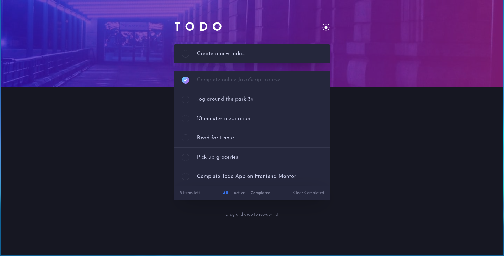
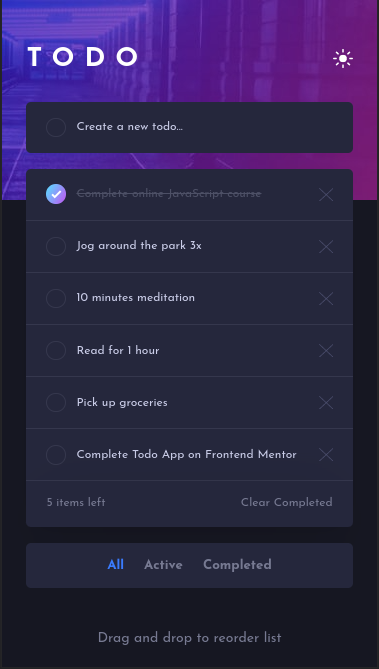

# Frontend Mentor - Todo app solution

This is a solution to the [Todo app challenge on Frontend Mentor](https://www.frontendmentor.io/challenges/todo-app-Su1_KokOW). Frontend Mentor challenges help you improve your coding skills by building realistic projects.

## Table of contents

- [Frontend Mentor - Todo app solution](#frontend-mentor---todo-app-solution)
  - [Table of contents](#table-of-contents)
  - [Overview](#overview)
    - [The challenge](#the-challenge)
    - [Screenshot](#screenshot)
    - [Links](#links)
  - [My process](#my-process)
    - [Built with](#built-with)
    - [What I learned](#what-i-learned)
    - [Continued development](#continued-development)
    - [Useful resources](#useful-resources)
  - [Author](#author)
  - [Acknowledgments](#acknowledgments)

## Overview

### The challenge

Users should be able to:

- ✅ View the optimal layout for the app depending on their device's screen size
- ✅ See hover states for all interactive elements on the page
- ✅ Add new todos to the list
- ✅ Mark todos as complete
- ✅ Delete todos from the list
- ✅ Filter by all/active/complete todos
- ✅ Clear all completed todos
- ✅ Toggle light and dark mode
- ✅ **Bonus**: Drag and drop to reorder items on the list

### Screenshots

#### Desktop

#### Mobile

### Links

- Solution URL: [https://www.frontendmentor.io/solutions/mobile-first-todo-app-with-react-and-styled-components-9YkbFfvR-](https://www.frontendmentor.io/solutions/mobile-first-todo-app-with-react-and-styled-components-9YkbFfvR-)
- Live Site URL: [https://hydenz.github.io/todo-app/](https://hydenz.github.io/todo-app/)

## My process

### Built with

- Semantic HTML5 markup
- Mobile-first workflow
- [Local Storage](https://developer.mozilla.org/en-US/docs/Web/API/Window/localStorage) - Web API to store client side data
- [React](https://reactjs.org/) - A Javascript library for building user interfaces
- [Styled Components](https://styled-components.com/) - CSS in JS
- [Typescript](https://www.typescriptlang.org/) - Typed JavaScript
- [react-transition-group](http://reactcommunity.org/react-transition-group/) - React Transitions made easy

### What I learned

In this project, I learned about [react-beautiful-dnd](https://github.com/atlassian/react-beautiful-dnd) which is a performant, clean and powerful API to handle Drag and Drop gestures

### Continued development

It's my first time using Styled Components, and I liked it's philosophy so much, that I intend to use it in most of my future projects

### Useful resources

- [react-beautiful-dnd free course](https://egghead.io/courses/beautiful-and-accessible-drag-and-drop-with-react-beautiful-dnd) - This helped me to get started on the library in few minutes.
- [Use Local Storage React Hook](https://usehooks.com/useLocalStorage/) - This is an amazing custom React Hook that helped me to manage browser's local storage.
- [Styled Components Docs](https://styled-components.com/docs) - The library's docs is very clear and straight

## Author

- Frontend Mentor - [@hydenz](https://www.frontendmentor.io/profile/hydenz)
- Twitter - [@hydenz99](https://twitter.com/hydenz99)
- LinkedIn - [Marcelo Figueiredo de Lima](https://www.linkedin.com/in/marcelo-figueiredo-de-lima-36809663/)
